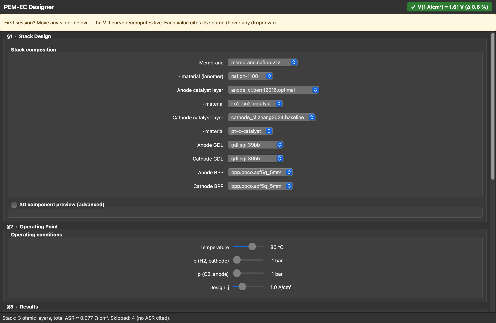

# pem-ec-designer

Desktop designer for **PEM water-electrolysis cells** — pick library
components, set operating conditions, get the polarisation curve, loss
decomposition and Levelised Cost of Hydrogen in one scrollable page.
Every numerical value cites a paper or datasheet.

**Status:** v0.1.0 release-candidate · **226/226 tests** · single-page
PySide6 UI · ADRs 001 – 006 · source-cited library of 18 components.



## What you can do today

- **§1 Stack Design** — pick 7 components + 3 catalyst/membrane materials
  from a strict-source-cited library; hover any dropdown for the BibTeX key.
- **§2 Operating Point** — T (50–95 °C), p_H₂, p_O₂, design-j (0.1–4 A/cm²)
  on live sliders; nothing buffered, no "Calculate" button.
- **§3 Results** — V–I curve + stacked loss-waterfall (E_rev, η_OER, η_HER,
  η_ohmic) rendered with consistent colours from UX-VISION §7.
- **§4 Economics** — LCOH (€/kg H₂) with CapEx + electricity slider;
  Schmidt-2017 anchor (3.7 €/kg at the default stack).
- **§5 Export** — V–I CSV with self-documenting header, BibTeX-subset of
  only the keys cited by the current stack.
- **Header validation badge** — V(1 A/cm²) vs. Bernt-2016 anchor
  (1.50–1.70 V band), click for the deviation breakdown.

Geometry layer (build123d) ships STEP for each individual component
already; **stack-level STEP** is next session's work (ADR-007).

## Quickstart

```bash
# 1.  create venv
python3.11 -m venv .venv
source .venv/bin/activate

# 2.  install package + UI + dev deps
pip install -e ".[dev,ui]"

# 3.  run the suite (no Qt needed for most of it)
pytest

# 4.  launch the app
python -m pem_ec_designer
```

State (selected stack, slider positions, LCOH parameters, window size,
onboarding flag) is auto-persisted to your platform-native
`QSettings` between runs.

### Keyboard shortcuts (UX-VISION §11)

| Shortcut | Action |
|---|---|
| `Cmd+E` | Export V–I CSV |
| `Cmd+D` | Toggle 3D component preview |
| `Cmd+R` | Reset stack + operating point + LCOH to defaults |
| `?`     | Help dialog with the shortcut list |
| `Cmd+Q` | Quit (Qt default) |

## Architecture

Layer-trennung per [ADR-001 §3.1](docs/adr/001-framework-choice.md);
CI test [`test_no_qt_imports.py`](tests/test_no_qt_imports.py) keeps
the physics layer Qt-free.

```
src/pem_ec_designer/
├── ui/             # PySide6 widgets + tooltips + persistence
├── export/         # CSV + BibTeX-subset writers (no Qt)
├── assembly/       # stack composition + library filters + source collector
├── geometry/       # build123d wrappers (extrude, flow-field, membrane)
├── physics/        # 0-D thermodynamics, kinetics, ohmic, polarisation,
│                   #   efficiency, LCOH — no Qt, no build123d
├── materials/      # library loader (cross-checks against BibTeX)
├── schema/         # Pydantic models (single source of truth)
└── foundation/     # CODATA 2018 constants, SI-internal units
```

### Architecture decisions

| ADR | Topic | Status |
|---|---|---|
| [001](docs/adr/001-framework-choice.md) | PySide6 + pyvistaqt + build123d | Accepted |
| [002](docs/adr/002-library-architecture.md) | Library: Pydantic schema, BibTeX, hierarchical IDs | Accepted |
| [003](docs/adr/003-qt-binding-license.md) | PySide6 (LGPL) — keeps product license free | Accepted |
| [004](docs/adr/004-physics-model.md) | 0-D · steady · isothermal · BV + ASR | Accepted |
| [005](docs/adr/005-lcoh-model.md) | LCOH: amortised CapEx + OpEx + grid (Schmidt-2017 style) | Accepted |
| [006](docs/adr/006-stack-composer.md) | 9-dropdown stack composer, σ-cut-off for membrane materials | Accepted |
| 007 (planned) | Stack-level STEP-export aggregation | — |

## The library

`library/` is the data side — JSON specs + a single `sources.bib`,
edited by humans, cross-validated by Pydantic on load.

| Category | Count | Examples |
|---|---|---|
| membrane         | 5 | Nafion 115/117/211/212 · Aquivion E87 |
| anode_cl         | 2 | Bernt 2016 optimal / low-ionomer |
| cathode_cl       | 2 | Zhang 2024 baseline / ultra-low Pt |
| gdl              | 8 | Toray TGP-H 030/060/090/120 · SGL 22BB/28BC/36BB/39BB |
| bpp              | 1 | POCO AXF-5Q |
| materials (ionomers + catalysts + BPP substrate) | 5 | nafion-1100, aquivion-870, IrO₂/TiO₂, Pt-C, POCO AXF-5Q |
| sources.bib      | 20 BibTeX entries (papers + datasheets) | — |

Strict-quellen policy ([ADR-002 D4](docs/adr/002-library-architecture.md)):
every numerical value must cite a paper or datasheet. Missing references
break test_library.py.

## Validation against literature

| Gate | Result | Anchor |
|---|---|---|
| V(1 A/cm², 80 °C) | 1.61 V | Bernt 2016 band 1.50–1.70 V ✓ |
| V(2 A/cm², 80 °C) | 1.76 V | Carmo 2013 band 1.70–2.00 V ✓ |
| E_rev,STP | 1.229 V | CODATA |
| LCOH (default stack, 50 €/MWh) | 3.71 €/kg | Schmidt 2017 PEM band 3.5–5.5 €/kg ✓ |
| Layer separation: no Qt in physics/ | ✓ | tests/test_no_qt_imports.py |

## Scope (v1.0)

**In:** desktop app · Python + PySide6 · one cell (not multi-cell stack)
· source-cited library · build123d-CAD for each component · 0-D physics
· LCOH-lite.

**Out (v1.x or later):** Compare-Drawer, multi-cell stack with thermal
de-rating, parametric sweep, PDF reports, project-file format, web UI,
CFD, 1-D fluid, multi-user.

**Never:** values without paper or datasheet source.

## Roadmap

| Phase | Status |
|---|---|
| Library scaffold + 18 components | ✓ done |
| Geometry layer (build123d STEP per component) | ✓ done |
| 0-D physics (thermo, kinetics, ohmic, polarisation) | ✓ done |
| Assembly bridge to physics inputs | ✓ done |
| Single-page UI (composer + sliders + plots + LCOH + exports) | ✓ done |
| Validation badge + source tooltips | ✓ done |
| QSettings persistence + shortcuts + onboarding | ✓ done |
| Stack-level STEP export (needs ADR-007) | next |
| v0.1.0 GitHub release | next |
| Compare-drawer, sweep, PDF | v1.x |

## License

Code license **TBD** — see [`docs/adr/003-qt-binding-license.md`](docs/adr/003-qt-binding-license.md):
Qt binding is PySide6 (LGPL), which keeps the product license free
(proprietary, MIT, Apache, GPL all possible). PyQt6 (GPL) explicitly
rejected.

Pending decision before the v0.1.0 tag.
